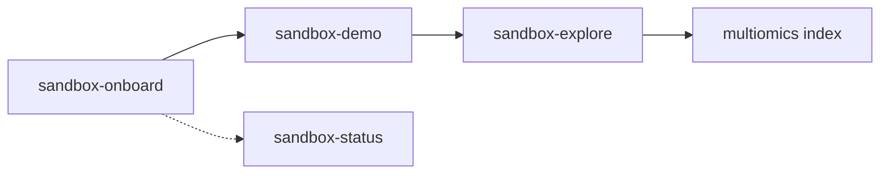

# Element Biosciences agent skills & plugins

Public marketplace of Element Biosciences plugins and agent skills for **Claude** (Desktop
and Claude Code) and **Cursor**.

Marketplace name: **`elembio`**

## Plugins

| Plugin | What it does |
| --- | --- |
| `cloud-sandbox` | Connects your agent to the **ElemBio Cloud sandbox MCP** — remote compute plus your Element Biosciences cloud data for multiomics, QC, and spatial analysis. Sign in with your ElemBio account via browser (OAuth). Production endpoint: `mcp.usw2.elembio.io/sandbox`. |

### What `cloud-sandbox` is for

Use it when you want to **explore or analyze your Element Biosciences / AVITI run data** and
need compute for it:

- List and resolve runs, executions, and storage connections; download or mount your data.
- Run multiomics, single-cell, spatial, imaging, OPS, QC, or differential-expression analysis
  in a remote Python kernel with the analysis stack (`spatialdata`, `scanpy`, `anndata`,
  `squidpy`, …) and `elembio-cli` **preinstalled**.

The sandbox acts as you (the signed-in user) and mounts your cloud data in place — no copying,
no local setup. If you also have the `elembio` CLI installed locally, it stays handy for quick
run/metadata listing and small downloads; the sandbox covers everything else, including when
the CLI is not installed.

After you install, tell your agent **`onboard elembio`**. It authenticates the MCP, checks for
the companion analysis plugin, and routes the next step.

The bundled `sandbox-environment` skill tells the agent when to use the local CLI versus the
sandbox. Analysis itself is driven by the Element Biosciences `multiomics` skills. Install the
`multiomics-preview` plugin from `Elembio/agent-skills-preview` alongside this one for QC,
normalization, and the modality-specific pipelines.

### Features

- **Guided onboarding** (`onboard elembio`): connect the MCP, install the companion plugin, and
  pick the next step.
- **Live demo** (`show me how the sandbox works`): one run, mounted, tables listed.
- **Explore this run** (`what can I ask of this run`): questions the present modalities support,
  then a handoff to the matching multiomics skill.
- **Health checks** (`sandbox status`): connection, waste, and a router into recovery.

### How the skills fit together



## Install

### Claude Desktop (and claude.ai)

1. **Customize → Plugins → `+` → Add from a repository**, and give it `Elembio/agent-skills`.
2. Install **`cloud-sandbox`**.
3. Open the connector and **Connect** to complete the browser sign-in (OAuth).

The bundled skills then load automatically. Tell your agent **`onboard elembio`** to finish setup.

### Claude Code

```
/plugin marketplace add Elembio/agent-skills
/plugin install cloud-sandbox@elembio
```

Authenticate on first use of a sandbox tool — Claude Code opens the browser sign-in
automatically (`/mcp` shows connection status). Then tell the agent **`onboard elembio`**.

### Cursor

Marketplaces are added from the dashboard:

1. **Dashboard → Plugins → Add Marketplace** (under *Team Marketplaces*), choose **Import from
   Repo**, and give it `Elembio/agent-skills`.
2. Open **Customize**, find `cloud-sandbox`, and **Install**.
3. Connect the `elembio-sandbox` MCP server and complete the browser sign-in.
4. Tell your agent **`onboard elembio`**.

## Authentication

`cloud-sandbox` uses your **ElemBio account** via browser OAuth — there is no API key to paste.
Generate/manage your account access at [elembio.io](https://elembio.io). Nothing secret is
stored in this repository.

## Disclaimer

This content is provided "as-is" without warranty of any kind. AI-generated output may contain
inaccuracies. Review and verify all outputs before relying on them.

## License

Licensed under the Apache License, Version 2.0. See [LICENSE](./LICENSE) and [NOTICE](./NOTICE).
